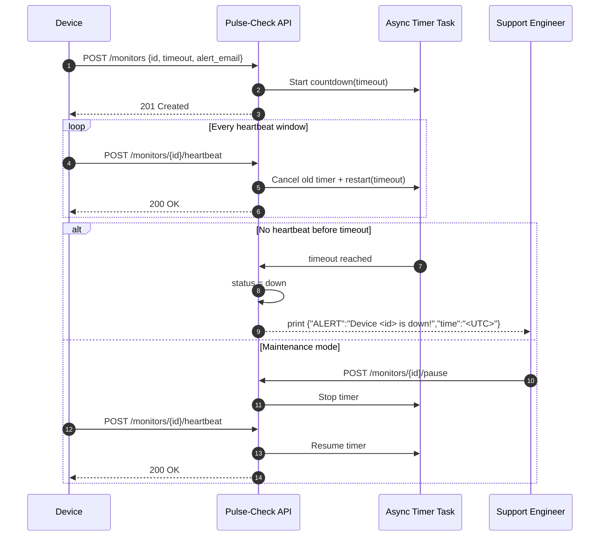

# Pulse-Check-API (Watchdog Sentinel)

A Dead Man's Switch backend service that monitors remote devices by tracking periodic heartbeat signals.
If a device stops sending heartbeats within a configured timeout window, the system automatically triggers an alert, allowing operations teams to respond immediately to potential outages or failures.

## 1. Architecture Diagram



## 2. Setup Instructions

### Prerequisites

- Python 3.10+

### Change into the project directory (if needed)
```bash
cd Pulse-Check-API
```

### Install dependencies

```bash
pip install -r requirements.txt
```

### Start the server

```bash
uvicorn main:app --reload
```

### Open interactive API docs

- Swagger UI: `http://127.0.0.1:8000/docs`
- ReDoc: `http://127.0.0.1:8000/redoc`

## 3. API Endpoints Documentation

Base URL: `http://127.0.0.1:8000`

### `POST /monitors`

Register a new monitor and start its countdown timer.

Request body:

```json
{
  "id": "device-123",
  "timeout": 60,
  "alert_email": "admin@critmon.com"
}
```

Success response: `201 Created`

```json
{
  "message": "Monitor device-123 registered",
  "monitor": {
    "id": "device-123",
    "timeout": 60,
    "alert_email": "admin@critmon.com",
    "status": "alive",
    "created_at": "2026-03-31T18:45:00+00:00",
    "updated_at": "2026-03-31T18:45:00+00:00",
    "last_heartbeat": "2026-03-31T18:45:00+00:00",
    "expires_at": "2026-03-31T18:46:00+00:00",
    "remaining_seconds": 60
  }
}
```

### `POST /monitors/{id}/heartbeat`

Resets the monitor timer to prevent alert triggering. If monitor was paused, it is automatically resumed.

Success response: `200 OK`

```json
{
  "message": "Heartbeat received for device-123",
  "monitor": {
    "id": "device-123",
    "status": "alive"
  }
}
```

Possible errors:

- `404 Not Found` if monitor does not exist
- `409 Conflict` if monitor is already `down`

### `POST /monitors/{id}/pause`

Pauses monitoring and stops the timer (no alert will fire while paused).

Success response: `200 OK`

```json
{
  "message": "Monitor device-123 paused"
}
```

Possible errors:

- `404 Not Found` if monitor does not exist
- `409 Conflict` if monitor is already `down`

### `GET /monitors/{id}`

Returns current monitor state and remaining seconds.

Success response: `200 OK`

```json
{
  "id": "device-123",
  "timeout": 60,
  "alert_email": "admin@critmon.com",
  "status": "alive",
  "created_at": "2026-03-31T18:45:00+00:00",
  "updated_at": "2026-03-31T18:45:20+00:00",
  "last_heartbeat": "2026-03-31T18:45:20+00:00",
  "expires_at": "2026-03-31T18:46:20+00:00",
  "remaining_seconds": 55
}
```

### Alert behavior on timeout

If a timer expires with no heartbeat, the service logs:

```json
{ "ALERT": "Device device-123 is down!", "time": "2026-03-31T18:47:00+00:00" }
```

The monitor state is set to `down`.

## 4. Developer's Choice Feature

Feature implemented: `GET /monitors/{id}` monitor status endpoint.

Why it helps:

- Gives support teams immediate visibility into `alive`, `paused`, or `down` state.
- Exposes `remaining_seconds` so teams can see how close a device is to alerting.
- Improves debuggability without requiring direct access to server logs.

## 5. Notes

- Storage is in-memory for challenge simplicity, so data resets when the process restarts.
- Timers are managed with async tasks and safely replaced on heartbeat reset.

