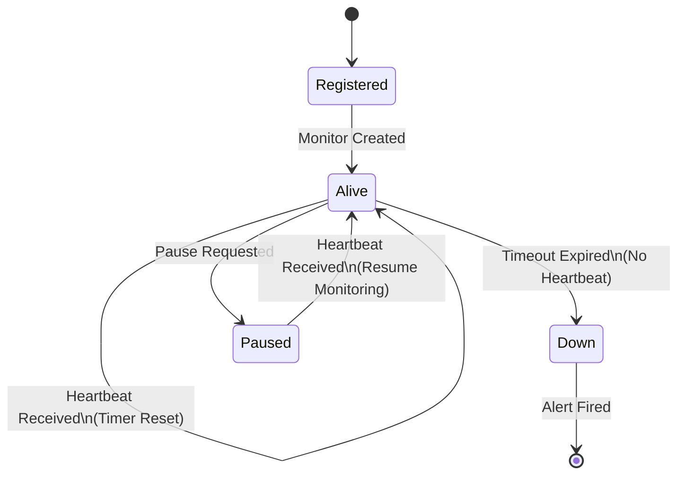

````markdown
# Pulse Check API

A Dead Man’s Switch backend service that monitors remote devices by tracking periodic heartbeat signals.  
If a device stops sending heartbeats within a configured timeout window, the system automatically triggers an alert, allowing operations teams to respond immediately to potential outages or failures.

---

## Architecture Overview

The system is designed as a **state-driven monitoring service** where each device monitor transitions between states based on heartbeat activity and timer expiration.

### Monitor State Flow



---

## Tech Stack

- Python
- FastAPI
- Uvicorn

---

## Running the Project

### Install dependencies

```bash
pip install fastapi uvicorn
```

### Start the server

```bash
uvicorn main:app --reload
```

### Open interactive API docs

```
http://127.0.0.1:8000/docs
```

---

## Planned API Endpoints

### Register Monitor

```
POST /monitors
```

Registers a device and starts a countdown timer.

---

### Heartbeat

```
POST /monitors/{id}/heartbeat
```

Resets the timer to prevent alert triggering.

---

### Pause Monitoring

```
POST /monitors/{id}/pause
```

Stops the timer until a heartbeat resumes monitoring.

---

## Developer’s Choice Feature

**Pause / Resume monitoring** was added to prevent false alerts during scheduled maintenance windows.